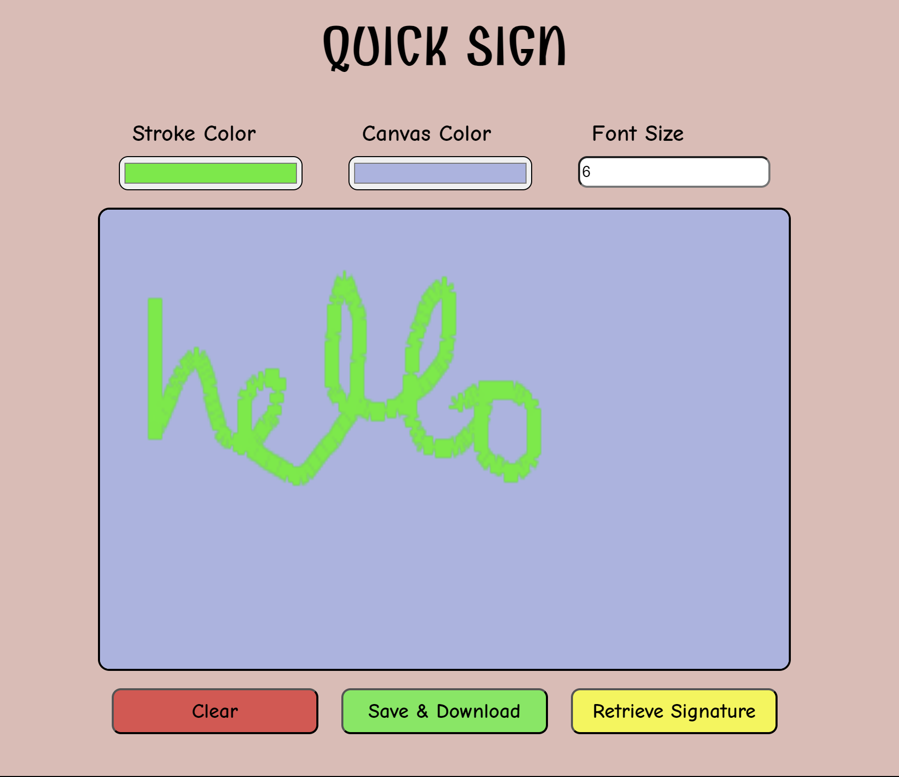

# Quick Sign Project

## Overview
Quick Sign is a web-based application that allows users to quickly and easily create signatures, which can be downloaded to their local system. This project is built for providing a simple and intuitive interface for users to sign their name and save the signature as an image file.

## Features
- **Canvas for Signature**: A responsive canvas where users can draw their signature.
- **Custom Stroke and Canvas Color**: You can select color of stroke and canvas background colors as per your will.
- **Clear Button**: Allows users to reset the canvas if they want to start over.
- **Download Button**: Users can download their signature as a PNG file.
- **Retrieve Button**: To retrieve the saved sign.

## Demo
For Demo [Click here](https://kc1064.github.io/Quick-Sign/).


## Getting Started

### Prerequisites
To run this project, you only need a modern web browser.

### Installation
1. Clone the repository:
   ```sh
   git clone https://github.com/kc1064/quick-sign-project.git
   ```

2. Navigate to the project directory:
   ```sh
   cd quick-sign-project
   ```

3. Open the `index.html` file in your browser to use the application.

### Usage
1. Open the application in your browser.
2. Draw your signature on the canvas using your mouse or touch input.
3. Click the "Clear" button to erase the canvas if needed.
4. Click the "Download" button to save your signature as a PNG file.

## Code Structure
- **index.html**: The main HTML file containing the structure of the application.
- **style.css**: The CSS file for styling the application.
- **script.js**: The JavaScript file containing the logic for drawing on the canvas and downloading the signature.

